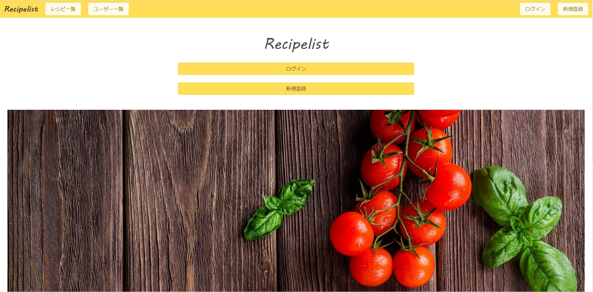

# Recipelist

## サービス概要

「Recipelist」は、レシピの投稿機能を利用して自作レシピの共有を可能にしたアプリケーションです。

## 作る上で意識したこと
一つ一つの機能自体はいたってシンプルなものばかりであり、独創的で面白い作品であるかを問われればあまり自信を持てません。しかしながら、Rails最大の強みでもある「MVCアーキテクチャ」の概念に忠実に従い、何よりも基本を意識して作りました。

まずユーザー目線に立ち、どのような機能が必要かを考え素人なりに必死に手を動かしました。

## URL
https://ay4528-recipelist.herokuapp.com/

    ゲストユーザーアカウント
    メールアドレス：guest@guest.jp
    パスワード：guest1234
    
## 開発環境&導入技術
・言語→Ruby(2.5.3)  
・フレームワーク→Ruby on Rails(5.2.5)  
・データベース→sqlite3  
・インフラ→Heroku  
・ツール→Github  
・ログイン機能→devise  
・画像投稿→refile、refile-s3  
・ページネーション→kaminari  
・CSSフレームワーク→Bulma  
・コードチェック→rubocop
